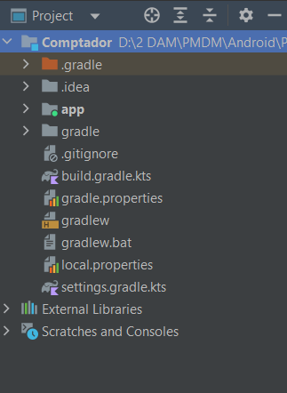
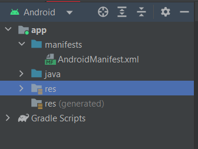
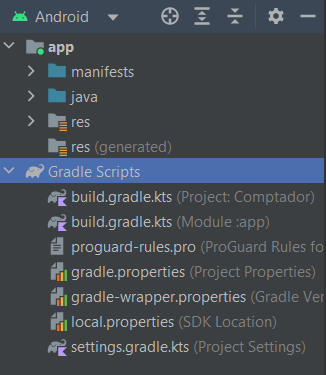
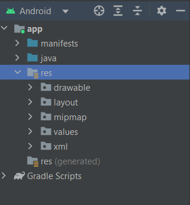
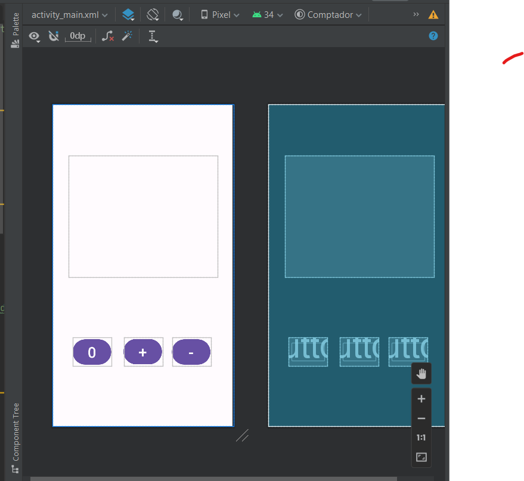
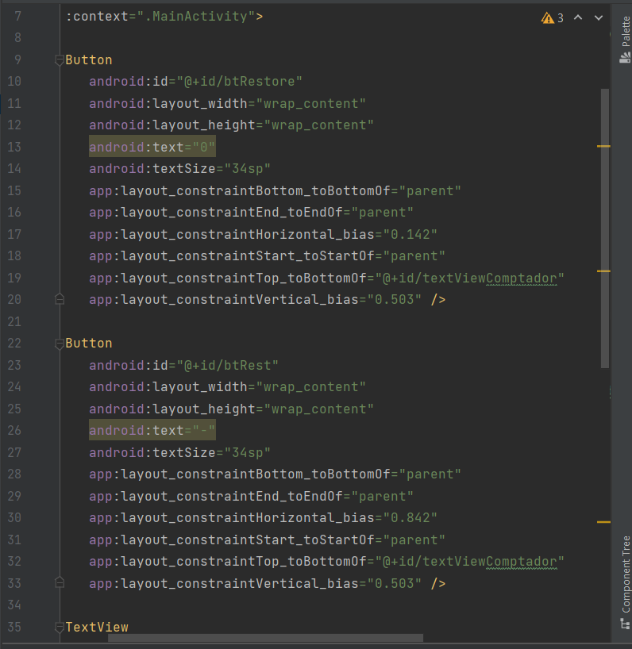
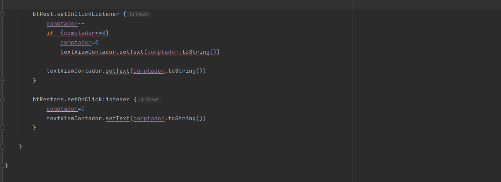
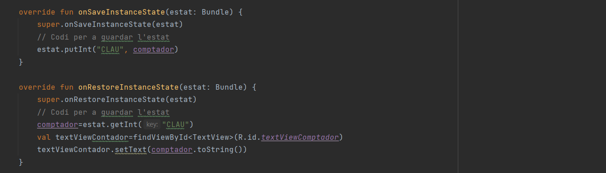

### Documentación Proyecto PMDM Miguel Angel Altur Gallego

### 1 Estructura del proyecto:
Este proyecto es una aplicación la cual su funcionalidad es la de actura como un contador de clics con sus diferente opciones como sumar ,restar o reestablecer el total del contador y evitando el reset de este cuando el dispositivo se gira.

Tiene una estructura tipica de un proyecto Gradle, con ficheros generales de aplicacion en la carpeta Raíz, asi como la propia del modulo de aplicación de esta información, organizado en cuatro carpetas lògicas: manifest, java,res i Gradle Scripts.
Las más destacables son:

Fichero de descripción:"app/AndroidMainFest.xml". Define el proyecto.

Scripts Gradle de construción em formato Kollin DSL "Comunica todos los modulos".

SRC, contiene el codig fuente de la aplicación.

APP/SRC/RES es donde se encuentran los recursos de la aplicación la cual contiene un sistea de subcarpetas para diferentes recursos.

### 2.Ciclo de vida y problema de la perdida de estado:

En esta apliación podemos detectar una vez hecho los pasos de implementación de los botones que surge un problema a la hora de  que el contador mantenga su información cuando el dispositivo cambia de sentido, lo cual provoca un reinicio del contador.
Para resolver este problema tenemos que implementar 2 funciones:

onSaveInstaceState, sirve para guardar el valor actual de la variable.
onRestoreInstaceState, sirve para mostrar el valor actual de la variable.

una vez implementadasa estas 2 funciones surgia un leve error de que refresacava visualmente el contador a 0 teniendo acumulado su valor previo.
Para resolver este problema he utilizado la siguiente liniea:

val textViewContador, para iniciarlizarla en el metodo y luego mostrarla por pantalla con, "textViewContador.setText(comptador.toString())".

### 3 Funcionalidad con reseteos y decrementos:

Dentro del fichero "activity_main.xml" e creado la interfaz de los 2 botones y luego con la opcion del boton de code a accedido para poder crear el codigo y modificar los nombres de estos y assignarles sus respectivos nombres.

Una vez hecho esto aplique codigo para que restasen o reseteasen el acumulador mediante las funciones "setOnClickListenner". 

